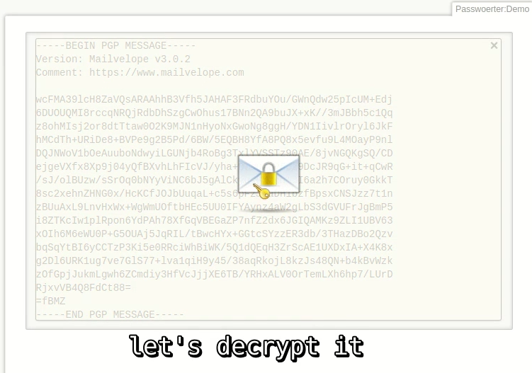

PGP-Inline-Support for DokuWiki
=======

Install
-------

Install the plugin over the webfrontend by using the url:  
https://github.com/user9209/PGP-Inline-Support-DokuWiki/archive/master.zip

How to use
----------

Use Mailvelope (https://www.mailvelope.com):

1) Generate a Key-Pair
2) Add current tab to "Authorized Domain" (do NOT use API)
3) When editing a page press Mailvelope-Button and encrypt text
4) Save page as normal
5) See Mailvelope-Button on page
6) Press decrypt and enter your password

Without this Plugin, step will 6 fail.

Copyright
---------

Plugin code is under GPL 3 license by Georg Schmidt.  

Tested
------

Dokuwiki Version: 2018-04-22b

Video
------

